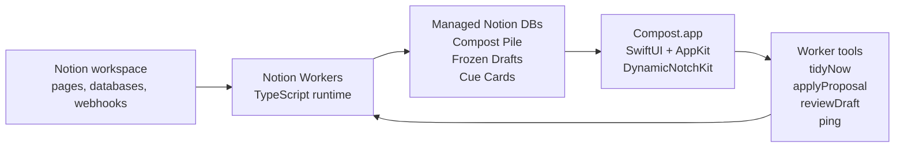

# Compost

> A Notion app that gives your workspace a sense of time.

Built for the **Notion Developer Platform Hackathon, May 16-17 2026**.

Compost is not another chatbot over your notes. It is a small autonomous system that notices what time does to a workspace:

- pages rot
- drafts written at 1 a.m. probably need a morning pass
- the doc you need next is usually buried two tabs away
- a workspace changes quietly until no one remembers what shifted

So Compost gives Notion four time-aware instincts: a gardener, a night editor, a cue card, and a weekly memory.

## The Demo

Open the MacBook. The notch wakes up.

It does not show a feed. It does not ask you to chat. It quietly says what matters now:

> App shell checkpoint now. Gardener proof at 12:15.

Click the notch and Compost expands into a calm review surface:

- **Cue** shows the current and next moment from a Notion page with time markers.
- **Gardener** shows proposed cleanup actions, each with a reason and an approval checkbox.
- **Sleep-On-It** shows late-night drafts side by side with a calmer rewrite.

The Workers do the work. The notch is just the ambient surface.

## Why This Fits The Hackathon

Compost is built around the platform primitives, not around a prompt box.

| Hackathon agenda | Compost |
|---|---|
| Autonomous Sidekick | Workers run on schedules, react to webhooks, and maintain state in Notion. |
| Workflow Relay | Notion pages become signals, Workers translate them into reviewable artifacts, the app triggers actions. |
| Chaos Mode | A tiny gardener living in the MacBook notch that can tidy your Notion, but only with permission. |
| Technical demo | Live Worker syncs, webhook/tool surfaces, managed databases, and a native macOS client. |
| Implementation difficulty | TypeScript Workers, Notion managed DB schemas, rate-limited workspace walking, SwiftUI/AppKit notch UI. |
| Impact | Notion workspaces decay in the real world; Compost makes that decay visible and reversible. |

## What It Does

### Gardener

The Gardener is the past tense of Compost.

It walks the workspace, scores pages for rot, and writes proposals into a managed Notion database called **Compost Pile**.

Signals include:

- stale edits
- orphaned pages
- thin stubs
- missing operational tags
- broken internal links

Gardener can propose actions such as `archive`, `delete_stub`, `fix_link`, `add_tag`, and `merge`.

Important: it never silently destroys user content. The apply pass only acts on rows where:

```text
Approved = true
Applied = false
```

After applying, it stamps `Applied = true`, making the operation idempotent.

### Sleep-On-It

Sleep-On-It is the late-night safety rail.

A Notion webhook listens for page updates. If a page is edited between 10 p.m. and 6 a.m., the Worker can freeze a snapshot and ask Claude for a calmer rewrite. In the morning, the user sees both versions side by side and chooses:

- keep mine
- use calmer

The Worker never replaces the page without review.

### Cue

Cue is the imminent future.

Tag any Notion page with `[!cue]` in the title, write time markers like `10:45 AM` or `2:30 PM`, and Cue parses the page into a tiny live card:

```text
Current: App shell checkpoint
Next: Gardener proof in 44 min
```

This is the hackathon-day moment: Compost can read the schedule everyone keeps checking and surface the next useful thing in the notch.

### The Weekly

The Weekly is the zoom-out layer and remains stretch for the hackathon build.

The intended version snapshots the workspace, detects meaningful changes across the last seven days, and writes a Sunday digest into Notion.

## Architecture



## Worker Capabilities

| Capability | Type | Purpose |
|---|---|---|
| `ping` | tool | Remote sanity check. |
| `cue` | sync | Parses `[!cue]` pages and writes current/next cards. |
| `gardener` | sync | Scores workspace rot and writes cleanup proposals. |
| `tidyNow` | tool | Refreshes Gardener proposals without mutating target pages. |
| `applyProposal` | tool | Approves and applies one safe demo Gardener proposal. |
| `onLateNightEdit` | webhook | Receives Notion page update events for Sleep-On-It. |
| `sleepOnItReviewer` | sync | Moves frozen drafts into morning review. |
| `sleepOnItCleanup` | sync | Expires stale draft reviews. |
| `reviewDraft` | tool | Approves or rejects a frozen draft. |

## Safety Model

Compost is intentionally conservative.

- No auto-delete.
- No external database.
- No broad OAuth build during the hackathon.
- No Streamlit, no generic RAG, no AI companion pattern.
- All state lives in Notion managed databases.
- Destructive actions require explicit approval and are idempotently stamped.
- Worker API calls are paced to respect Notion's rate limit.

## Stack

- **Notion Workers** with `@notionhq/workers`
- **Notion managed databases** for state
- **Notion webhooks** for late-night page updates
- **Notion Worker tools** for `tidyNow`, `applyProposal`, and `reviewDraft`
- **SwiftUI + AppKit** for the macOS client
- **DynamicNotchKit** for the notch/floating surface
- **Claude** for calm rewrite and cue phrasing
- **OpenAI embeddings** planned for duplicate detection

## Run The Workers

```bash
cd workers
npm install
npm run check
ntn doctor
ntn workers deploy
```

Create a local `workers/.env` from `workers/.env.example`, then push secrets:

```bash
ntn workers env push --yes
ntn workers exec ping -d '{}'
ntn workers sync trigger cue --preview
ntn workers sync trigger gardener --preview
```

The Notion token in `workers/.env` should be an internal integration token with access to the demo workspace pages.

For rehearsal, reset only safe demo rows and regenerate managed DB output:

```bash
cd workers
npm run demo:reset
```

## Run The App

```bash
cd app
open Compost.xcodeproj
```

Build and run the `Compost` scheme on macOS 13 or later.

The app stores the Notion token and database IDs in Keychain and renders a compact notch/floating interface. On machines without a notch, DynamicNotchKit provides a floating fallback.

## Repo Workflow

This project was built solo with two agent collaborators:

- **Codex** owns `workers/**`
- **Claude Code** owns `app/**`
- Shared contracts live in `INTERFACE.md`
- Non-trivial work lands through pull requests

That split is part of the build: one human steering, two coding agents working different parts of the system, and PR review keeping the handoff honest.

## Pitch Line

> Your Notion has a relationship with time, and nobody manages it.

Compost does.

## License

MIT
