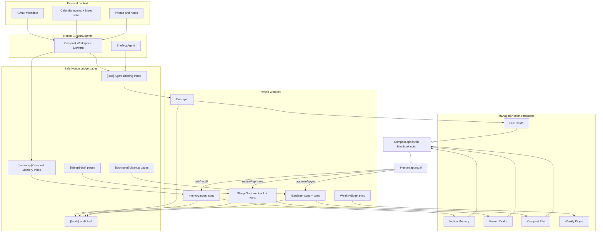
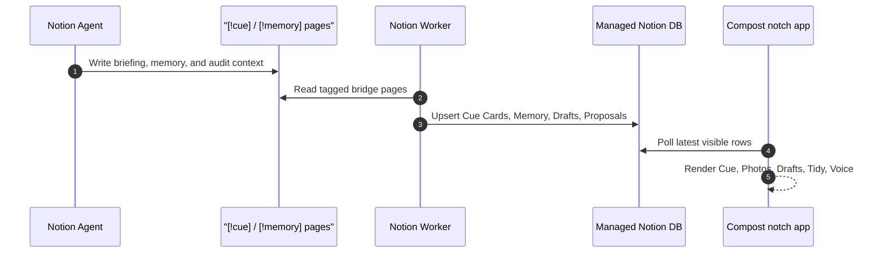
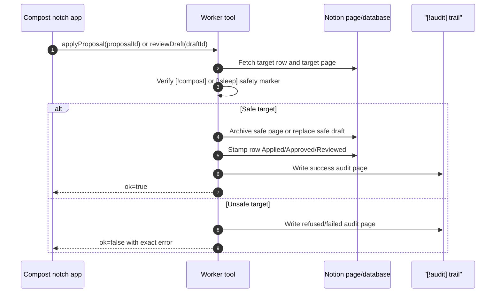

# Compost

> A Notion app that gives your workspace a sense of time.

Built for the **Notion Developer Platform Hackathon, May 16-17 2026**.

Compost is not another chatbot over your notes. It is a small autonomous system that notices what time does to a workspace:

- pages rot
- drafts written at 1 a.m. probably need a morning pass
- the doc you need next is usually buried two tabs away
- a workspace changes quietly until no one remembers what shifted

So Compost gives Notion time-aware instincts: a gardener, a night editor, a cue card, a memory pile, and a weekly digest.

## The Demo

Open the MacBook. The notch wakes up.

It does not show a feed. It does not ask you to chat. It quietly says what matters now:

> App shell checkpoint now. Gardener proof at 12:15.

Click the notch and Compost expands into a calm review surface:

- **Cue** shows the current and next moment from Notion, Calendar, and Gmail context.
- **Memory** shows recent photo and note memories captured in Notion.
- **Gardener** shows proposed cleanup actions, each with a reason and an approval checkbox.
- **Sleep-On-It** shows late-night drafts side by side with a calmer rewrite.
- **Voice** lets you ask for the briefing, memories, drafts, or photos without opening Notion.

Agents gather context. Workers structure and guard it. Notion stores the truth. The notch is just the ambient action surface.

## Why This Fits The Hackathon

Compost is built around the platform primitives, not around a prompt box.

| Hackathon agenda | Compost |
|---|---|
| Autonomous Sidekick | Workers run on schedules, react to webhooks, and maintain state in Notion. |
| Workflow Relay | Notion pages become signals, Workers translate them into reviewable artifacts, the app triggers actions. |
| Chaos Mode | A tiny gardener living in the MacBook notch that can tidy your Notion, but only with permission. |
| Technical demo | Live Worker syncs, webhook/tool surfaces, managed databases, and a native macOS client. |
| Implementation difficulty | TypeScript Workers, Notion managed DB schemas, rate-limited workspace walking, SwiftUI/AppKit notch UI. |
| Impact | Notion workspaces decay in the real world; Compost makes that decay visible and reversible. |

## What It Does

### Agents and Bridges

Compost uses Notion Custom Agents as the context layer.

The agent can read approved sources such as Gmail, Calendar, and selected Notion pages, then write compact bridge pages:

- `[!cue] Agent Briefing Inbox` for current/next context
- `[!memory] Compost Memory Inbox` for captured notes and photos
- `[!audit] Compost Demo State` for traceability

Workers do not need direct Gmail or Calendar API access. They read the bridge pages, turn them into structured Notion database rows, and keep the app honest.

### Gardener

The Gardener is the past tense of Compost.

It walks the workspace, scores pages for rot, and writes proposals into a managed Notion database called **Compost Pile**.

Signals include:

- stale edits
- orphaned pages
- thin stubs
- missing operational tags
- broken internal links

Gardener can propose actions such as `archive`, `delete_stub`, `fix_link`, `add_tag`, and `merge`.
In the live demo, safe apply is implemented for `archive`, `delete_stub`, and `add_tag`; `fix_link` and `merge` are proposal-level extensions that intentionally do not mutate content yet.

Important: it never silently destroys user content. The apply pass only acts on rows where:

```text
Approved = true
Applied = false
```

After applying, it stamps `Applied = true`, making the operation idempotent.

### Sleep-On-It

Sleep-On-It is the late-night safety rail.

A Notion webhook listens for page updates. If a page is edited between 10 p.m. and 6 a.m., the Worker can freeze a snapshot and ask Claude for a calmer rewrite. In the morning, the user sees both versions side by side and chooses:

- keep mine
- use calmer

The Worker never replaces the page without review.

### Cue

Cue is the imminent future.

Tag any Notion page with `[!cue]` in the title, write time markers like `10:45 AM` or `2:30 PM`, and Cue parses the page into a tiny live card:

```text
Current: App shell checkpoint
Next: Gardener proof in 44 min
```

This is the hackathon-day moment: Compost can read the schedule everyone keeps checking and surface the next useful thing in the notch.

### Memory

Memory is the personal context layer.

Drop a photo or note into a `[!memory]` Notion page. The Memory worker captions images, infers lightweight tags, writes structured rows into **Notion Memory**, and exposes recall through the `recallMemory` tool.

That lets the notch answer things like:

```text
What do I remember from yesterday's photos?
```

The answer is grounded in real Notion memory rows, not generated sample data.

### The Weekly

The Weekly is the zoom-out layer.

It snapshots the workspace, detects meaningful changes across the last seven days, and writes a Sunday digest into Notion.

## Architecture

Compost is four cooperating layers:

1. **Agents** gather context from Gmail, Calendar, and Notion.
2. **Bridge pages** keep that context visible and editable inside Notion.
3. **Workers** transform bridge pages and workspace signals into managed database rows.
4. **The notch app** renders a tiny action surface and calls Worker tools only when the user approves.



### Demo Flow



### Safe Mutation Flow



## Worker Algorithms

### Gardener Decay Model

Gardener gives every candidate page five normalized scores from `0` to `1`, then computes:

```text
decay =
  0.35 * age +
  0.25 * orphan +
  0.20 * stub +
  0.10 * tagless +
  0.10 * broken_link
```

Pages surface when `decay >= 0.60`.

| Signal | Weight | Scoring rule | Why it matters |
|---|---:|---|---|
| Age | 0.35 | `days since last edit / 180`, capped at `1.0` | Old untouched content is most likely to rot. |
| Orphan | 0.25 | `0 inbound links = 1.0`; otherwise `1 - inbound / 3` | Pages nobody links to are harder to rediscover. |
| Stub | 0.20 | `1.0` when under 50 words, no child blocks, and older than 30 days | Tiny abandoned notes are likely safe cleanup candidates. |
| Tagless | 0.10 | Missing operational fields after 7 days scores `1.0`; earlier scores `0.5` | Database rows without structure become ambiguous. |
| Broken internal links | 0.10 | Missing Notion page mentions divided by total internal mentions | Dead internal references make pages less trustworthy. |

The live dead-link signal validates **internal Notion page mentions** against the pages found in the workspace crawl. External HTTP link checking is a natural next extension, but is not the demo mutation path.

### Gardener Action Criteria

| Criteria | Proposed action | Live apply behavior |
|---|---|---|
| `stub >= 0.7` | `delete_stub` | Archives the safe `[!compost]` target after approval. |
| `broken >= 0.5` | `fix_link` | Proposal exists; mutation is intentionally refused in the live demo. |
| `tagless >= 0.5` | `add_tag` | Sets `Status = Inbox` where the target schema supports it. |
| Otherwise `decay >= 0.60` | `archive` | Archives the safe `[!compost]` target after approval. |

### Worker Criteria

| Worker | Input | Criteria / algorithm | Output |
|---|---|---|---|
| Cue | `[!cue]` pages or pages with `Cue = true` | Parse time markers, sort the day timeline, pick current plus next, generate a calm 1-2 line cue. | **Cue Cards** |
| Memory | `[!memory]` source pages | Extract image/file blocks, caption photos, infer tags, create or reuse embeddings, archive duplicate stale rows. | **Notion Memory** |
| Sleep-On-It | late-night edits or `[!sleep]` demo pages | Freeze source text, generate calmer/crisp/diplomatic rewrites, require `[!sleep]` before replacing source content. | **Frozen Drafts** |
| Gardener | workspace pages | Score rot with the decay model, propose cleanup, require `[!compost]` before mutation. | **Compost Pile** |
| Weekly | workspace snapshots | Hash page markdown, compare to prior snapshot, summarize substantive edits above the word-delta threshold. | **Weekly Digest** |

## Worker Capabilities

| Capability | Type | Purpose |
|---|---|---|
| `ping` | tool | Remote sanity check. |
| `cue` | sync | Parses `[!cue]` pages and writes current/next cards. |
| `gardener` | sync | Scores workspace rot and writes cleanup proposals. |
| `tidyNow` | tool | Refreshes Gardener proposals without mutating target pages. |
| `applyProposal` | tool | Approves and applies one safe demo Gardener proposal. |
| `refreshBridge` | tool | Refreshes cue, memory, and tidy bridge surfaces. |
| `onLateNightEdit` | webhook | Receives Notion page update events for Sleep-On-It. |
| `sleepOnItReviewer` | sync | Moves frozen drafts into morning review. |
| `sleepOnItCleanup` | sync | Expires stale draft reviews. |
| `reviewDraft` | tool | Approves or rejects a frozen draft. |
| `rephraseDraft` | tool | Generates calmer, crisp, or diplomatic tone variants. |
| `memoryIngest` | sync | Turns `[!memory]` pages into structured memory rows. |
| `recallMemory` | tool | Searches recent or semantically relevant memories. |
| `voiceReply` | tool | Answers notch voice commands using visible context and memory. |
| `weekly` | sync | Builds the weekly workspace digest. |

## Safety Model

Compost is intentionally conservative.

- No auto-delete.
- No external database.
- No broad OAuth build during the hackathon.
- No Streamlit, no generic RAG, no AI companion pattern.
- All state lives in Notion managed databases.
- Destructive actions require explicit approval and are idempotently stamped.
- Worker API calls are paced to respect Notion's rate limit.

## Stack

- **Notion Workers** with `@notionhq/workers`
- **Notion managed databases** for state
- **Notion webhooks** for late-night page updates
- **Notion Worker tools** for `tidyNow`, `applyProposal`, `reviewDraft`, `rephraseDraft`, `recallMemory`, `voiceReply`, and `refreshBridge`
- **SwiftUI + AppKit** for the macOS client
- **DynamicNotchKit** for the notch/floating surface
- **Claude** for cue phrasing, memory captions, voice replies, and draft rewrites
- **OpenAI embeddings** for memory recall and future duplicate detection

## Run The Workers

```bash
cd workers
npm install
npm run check
ntn doctor
ntn workers deploy
```

Create a local `workers/.env` from `workers/.env.example`, then push secrets:

```bash
ntn workers env push --yes
ntn workers exec ping -d '{}'
ntn workers sync trigger cue --preview
ntn workers sync trigger gardener --preview
```

The Notion token in `workers/.env` should be an internal integration token with access to the demo workspace pages.

For rehearsal, reset only safe demo rows and regenerate managed DB output:

```bash
cd workers
npm run demo:reset
```

The reset restores the safe `[!sleep]` demo source back to a loud original,
clears local app resolved-row caches, and then retriggers the demo syncs so the
notch has fresh, visible actions again.

## Run The App

```bash
cd app
open Compost.xcodeproj
```

Build and run the `Compost` scheme on macOS 13 or later.

The app stores the Notion token and database IDs in Keychain and renders a compact notch/floating interface. On machines without a notch, DynamicNotchKit provides a floating fallback.

## Repo Workflow

This project was built solo with two agent collaborators:

- **Codex** owns `workers/**`
- **Claude Code** owns `app/**`
- Shared contracts live in `INTERFACE.md`
- Non-trivial work lands through pull requests

That split is part of the build: one human steering, two coding agents working different parts of the system, and PR review keeping the handoff honest.

## Pitch Line

> Your Notion has a relationship with time, and nobody manages it.

Compost does.

## License

MIT
